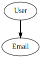
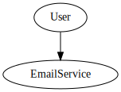
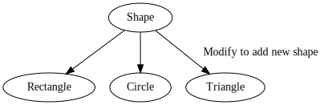
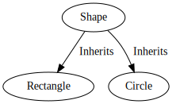
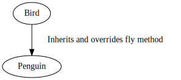
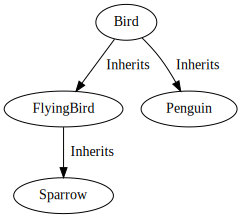
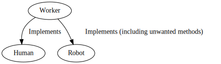
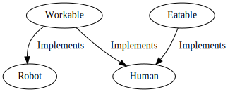
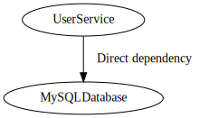
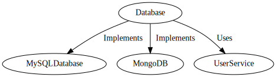

# SOLID Design Principles (AI generated)

## 1. Single Responsibility Principle (SRP)
**Definition**: A class should have only one reason to change, meaning it should have only one responsibility.

**Explanation**: The SRP encourages separation of concerns within a system. If a class has more than one responsibility, it risks being affected by changes in multiple areas, making the system more fragile.

**Example**:

### Incorrect Design
In the incorrect design, the `User` class handles both user data and email sending. This violates SRP because it has more than one reason to change.

### Correct Design
In the correct design, the `User` class is responsible only for user data, while the `EmailService` handles email-related functionality.

---

## 2. Open/Closed Principle (OCP)
**Definition**: Software entities (classes, modules, functions, etc.) should be open for extension but closed for modification.

**Explanation**: The OCP encourages designing software in a way that allows adding new functionality without altering existing code. This is often achieved using abstraction, such as interfaces or base classes.

**Example**:

### Incorrect Design
In the incorrect design, the `Shape` class has methods for every shape type. Adding a new shape requires modifying the existing `Shape` class, which violates OCP.

### Correct Design
In the correct design, the `Shape` class is abstract, and each shape (e.g., `Rectangle`, `Circle`) extends this class. New shapes can be added by creating new subclasses without modifying existing code.

---

## 3. Liskov Substitution Principle (LSP)
**Definition**: Subtypes should be substitutable for their base types without altering the correctness of the program.

**Explanation**: The LSP ensures that derived classes can replace base classes without causing unexpected behavior. Violating LSP can lead to code that behaves incorrectly when using polymorphism.

**Example**:

### Incorrect Design
In the incorrect design, `Penguin` inherits from `Bird` but overrides a `fly` method, which makes no sense for a penguin. This violates LSP as `Penguin` cannot replace `Bird` in all contexts.

### Correct Design
In the correct design, the class hierarchy is adjusted so that only birds that can fly inherit from `FlyingBird`, while `Penguin` directly inherits from `Bird`. This maintains the LSP.

---

## 4. Interface Segregation Principle (ISP)
**Definition**: Clients should not be forced to depend on interfaces they do not use.

**Explanation**: The ISP encourages the creation of specific interfaces for different functionalities, rather than a large, general-purpose interface. This makes implementations more flexible and focused.

**Example**:

### Incorrect Design
In the incorrect design, the `Worker` interface includes both `work` and `eat` methods. A `Robot` class that implements `Worker` would be forced to implement the `eat` method, even though it doesn't need it.

### Correct Design
In the correct design, `Workable` and `Eatable` are separate interfaces. `Human` implements both, while `Robot` only implements `Workable`, adhering to ISP.

---

## 5. Dependency Inversion Principle (DIP)
**Definition**: High-level modules should not depend on low-level modules. Both should depend on abstractions.

**Explanation**: The DIP promotes the use of abstractions (e.g., interfaces or abstract classes) rather than concrete implementations. This reduces the coupling between different parts of a system, making it more flexible and maintainable.

**Example**:

### Incorrect Design
In the incorrect design, `UserService` directly depends on a specific implementation of `Database` (e.g., `MySQLDatabase`). Changing the database type requires changes to `UserService`, which violates DIP.

### Correct Design
In the correct design, `UserService` depends on an abstract `Database` interface. Different database implementations (e.g., `MySQLDatabase`, `MongoDB`) can be used without altering `UserService`.

