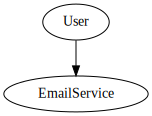

# SOLID Design Principles

## 1. Single Responsibility Principle (SRP)
**Definition**: A class should have only one reason to change, meaning it should have only one responsibility.

**Example**:

---

## 2. Open/Closed Principle (OCP)
**Definition**: Software entities (classes, modules, functions, etc.) should be open for extension but closed for modification.

**Example**:

---

## 3. Liskov Substitution Principle (LSP)
**Definition**: Subtypes should be substitutable for their base types without altering the correctness of the program.

**Example**:

---

## 4. Interface Segregation Principle (ISP)
**Definition**: Clients should not be forced to depend on interfaces they do not use.

**Example**:

---

## 5. Dependency Inversion Principle (DIP)
**Definition**: High-level modules should not depend on low-level modules. Both should depend on abstractions.

**Example**:

