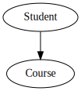
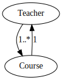
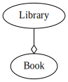
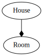
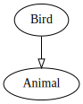
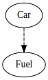
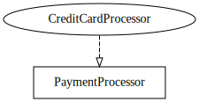

# Understanding UML Diagram Relationships

Unified Modeling Language (UML) diagrams are a powerful tool for visualizing and designing software systems. One key aspect of UML diagrams is how they represent the relationships between different classes. Here are some of the most common relationships:

## 1. Association
**Definition**: Association represents a relationship between two classes where one class uses or interacts with the other.

**Notation**: A solid line between the classes.

**Example**:
- A `Student` and a `Course`. A student enrolls in a course.

## 2. Multiplicity in Associations
**Definition**: Multiplicity specifies how many instances of a class can be associated with a single instance of another class.

**Notation**: Numbers at the ends of association lines (e.g., 1..*, 0..1).

**Example**:
- A `Teacher` can teach multiple `Courses`, but a `Course` is taught by exactly one `Teacher`.

## 3. Aggregation
**Definition**: Aggregation is a special form of association that represents a "whole-part" relationship, where the part can exist independently of the whole.

**Notation**: A solid line with a hollow diamond at the "whole" end.

**Example**:
- A `Library` contains `Books`, but `Books` can exist independently of the `Library`.

## 4. Composition
**Definition**: Composition is a stronger form of aggregation where the part cannot exist independently of the whole. If the whole is destroyed, the parts are destroyed as well.

**Notation**: A solid line with a filled diamond at the "whole" end.

**Example**:
- A `House` contains `Rooms`. If the `House` is destroyed, the `Rooms` no longer exist.

## 5. Inheritance (Generalization)
**Definition**: Inheritance represents an "is-a" relationship between a more general superclass and a more specific subclass.

**Notation**: A solid line with a hollow arrow pointing towards the superclass.

**Example**:
- A `Bird` is a type of `Animal`.

## 6. Dependency
**Definition**: Dependency represents a "uses" relationship where one class depends on another to function, but it's a weaker association.

**Notation**: A dashed line with an arrow pointing towards the class that is depended on.

**Example**:
- A `Car` depends on a `Fuel` to operate.

## 7. Realization
**Definition**: Realization is a relationship between an interface and a class that implements that interface.

**Notation**: A dashed line with a hollow arrow pointing towards the interface.

**Example**:
- A `PaymentProcessor` interface is implemented by a `CreditCardProcessor` class.

## Summary of UML Relationships

| Relationship  | Notation | Description |
|---------------|----------|-------------|
| Association   | Solid line | Basic relationship between two classes. |
| Aggregation   | Hollow diamond | Whole-part relationship where the part can exist independently. |
| Composition   | Filled diamond | Strong whole-part relationship where the part cannot exist independently. |
| Inheritance   | Hollow arrow | "Is-a" relationship between superclass and subclass. |
| Dependency    | Dashed line | Weaker "uses" relationship between classes. |
| Realization   | Dashed hollow arrow | Implementation relationship between an interface and a class. |

These relationships help in designing systems that are clear and easy to understand, ensuring that the interactions between different parts of the system are well-defined.
